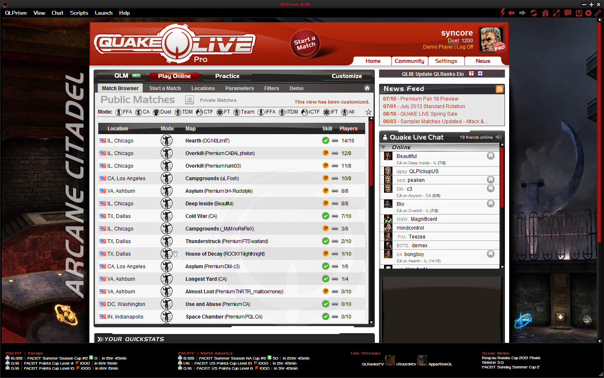

# QLPrism
[QLPrism.us website - http://www.qlprism.us](http://www.qlprism.us)

This repo contains source, installers, and miscellaneous files for the Windows release of the community-focused [Quake Live](http://www.quakelive.com) web launcher called [QLPrism](http://www.qlprism.us) that received fairly popular usage from Aug 2011 until Dec 2013. This application was built on top of the 1.9.2 version of [Mozilla's xulrunner](https://developer.mozilla.org/en-US/docs/Mozilla/Projects/XULRunner) runtime and provided extensive additional features for id software's FPS [Quake Live](http://www.quakelive.com), many of which were in the form of JavaScript "userscripts" which were contributed by QL's international community and browser extensions which were originally written for Firefox but were adapted to run using only xulrunner.

Special thanks for these contributions are extended to:

*Userscripts*: wn, flugsio, Sean Cline, uzz, aiken, Lam, kry, Drayan, simonov, rahzei, fusen, szr, xambro, rul3x

*Firefox extensions*: peol, The ChatZilla team, Sebastian Tschan

### Notes/History:
The majority of these parts were unfortunately packaged together (and in the cases of renaming) manually by hand without the use of any batch files or build scripts (*yikes!*)

This was simply uploaded for posterity sake and perhaps to demonstrate how [Mozilla's xulrunner](https://developer.mozilla.org/en-US/docs/Mozilla/Projects/XULRunner) runtime package can/could be repurposed as a desktop-based "HTML/JS application" at a time before node-webkit, Chrome Applications, et. al were as popular as they are today.

QLPrism was deprecated when id software fully discontinued NPAPI support and moved to their official "standalone" version of Quake Live on December 17, 2013.

**Mozilla Build Instructions/Prerequisites that were necessary at the time:**

[https://developer.mozilla.org/en-US/docs/Mozilla/Developer_guide/Build_Instructions](https://developer.mozilla.org/en-US/docs/Mozilla/Developer_guide/Build_Instructions)

[https://developer.mozilla.org/en-US/docs/Windows_Build_Prerequisites_%281.9.0_and_1.9.1_branches%29](https://developer.mozilla.org/en-US/docs/Windows_Build_Prerequisites_%281.9.0_and_1.9.1_branches%29)

**Version 1.6 of MozillaBuild**:

[http://ftp.mozilla.org/pub/mozilla.org/mozilla/libraries/win32/MozillaBuildSetup-1.6.exe](http://ftp.mozilla.org/pub/mozilla.org/mozilla/libraries/win32/MozillaBuildSetup-1.6.exe)

### Contents:

QLPrism Mozilla xulrunner 1.9.2 source: `/Xulrunner/qlprism-xulrunner-1.9.2.19.source.tar.bz2`

QLPrism Launcher source: `/Launcher/`

Updater DLL source [(WinSparkle by vslavik](https://github.com/vslavik/winsparkle)): `/Launcher/Updater/`

CloseQL source ([KPBN, Ravi Kochar](http://www.neurophys.wisc.edu/ravi/software/killproc/)): `/CloseQL/`

Installer files - [Astum InstallWizard 2.29.60](http://www.thraexsoftware.com/): `/Installer/`

Modified QLRanks Demo Uploader ([original source by sirax](http://sourceforge.net/p/qlrdemouploader/code/HEAD/tree/)) with updater source: `/QLRanksDemoUploader/`

Miscellaneous files: `/Misc/`

Distribution (Structure prior to being packaged by installer. Note, any .qla files can be renamed to .zip to modify the contents contained therein): `/PreDist/`